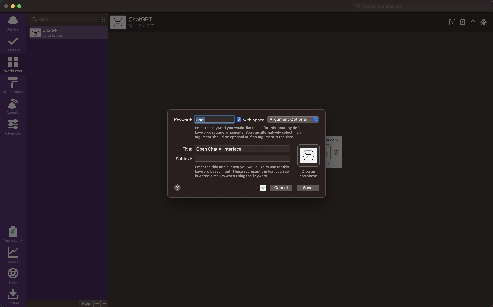
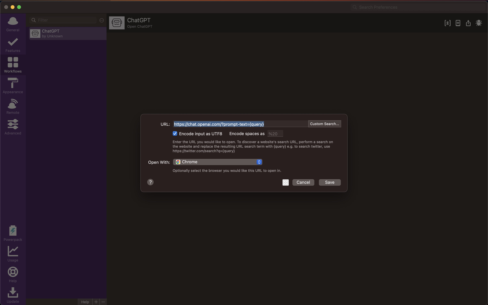

This chrome extension allows you to pass a query parameter to ChatGPT and places the text pased via the "prompt-text" query parameter into the prompt field and clicks the prompt button. This reduces the amount of steps that it takes to go from idea for a prompt to generating a result with Chat GPT.

This extension assumes you are using a Mac running Chrome and passing the query param via an Alfred workflow. However, you can use this extension however you would like as long as you pass the text to the query parameter called "prompt-text" on chat.openai.com.

# Getting Started

You must first sign-up for an account on ```chat.openai.com``` and login. This extension will only work if you are logged into ChatGPT.

## Cloning the Repository

1. Ensure you have git installed locally
2. Change directories to the one where you would like to store these files.
3. Run this command ```git clone https://github.com/ethanthompson/chatgpt-query-param-extension.git```

Alternatively, you can simply [download the files]((https://github.com/ethanthompson/chatgpt-query-param-extension/archive/refs/heads/main.zip)) and unzip them to any location on your computer. I would suggest placing the folder in a location that you know will not be deleted or changed. i.e. Don't store the files in your Downloads folder.

## Create Your Alfred Workflow

1. Open the Alfred app and open the workflows tool
2. Create a blank workflow
3. Create a keyword input using these settings
    1. 
5. Create an "Open URL" action using these settings
    1. 
    2. Be sure to use ```?prompt-text={query}``` in your URL. This will pass the value of your input to the browser URL and will allow the extension to grab it and place it in the prompt field.
6. Test your workflow by opening the Alfred field and type ```chat this is a test``` your browser should open and navigate to ```https://chat.openai.com/?prompt-text="this is a test```. If it doesn't, go back and check your steps.

## Install the Extension

1. Open ```chrome://extensions/``` and enabled Developer Mode. This should be a toggle in the upper right.
2. Click "Load Unpacked"
3. Navigate to the folder where you have cloned this repo and select it.
4. Enable the extension and accept the permission requirements

## Run a Test

1. Open Alfred
2. Type ```chat this is a test``` and hit ``Enter``
3. This should open Chrome and you should start seeing ChatGPT responding to the prompt.
4. You're done! Prompt away.